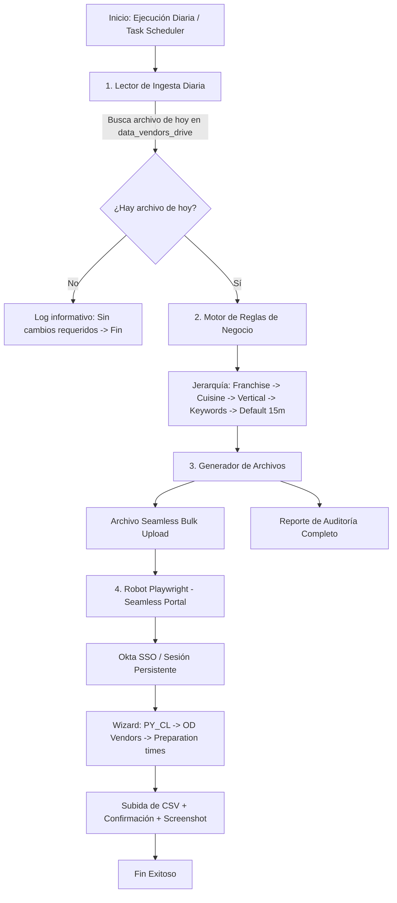

# 📘 Documento de Traspaso y Operación: Automatización de Preptime para Vendors (Seamless)

---

## 📌 1. Resumen Ejecutivo y Objetivo

Este proyecto automatiza el ciclo operativo diario de asignación de tiempos de preparación (**Preptime**) para los nuevos locales/proveedores (*vendors*) de PedidosYa en Chile, y realiza la carga masiva en el portal **Seamless Dashboard** sin requerir intervención manual repetitiva.

### ¿Qué hace la rutina?
1. **Ingesta Diaria**: Lee el archivo de vendors generado en el día desde la carpeta compartida (`data_vendors_drive`) o mediante consulta directa a BigQuery.
2. **Motor de Reglas de Negocio**: Aplica una jerarquía en cascada para calcular el tiempo óptimo de preparación en minutos para cada local.
3. **Generación de Entregables**:
   - Archivo CSV oficial para carga masiva en Seamless (`CODE,DAY-RANGE,HOUR-RANGE,PREPARATION-BUFFER,PREPARATION-TIME,STRATEGY`).
   - Reporte de Auditoría con toda la data original + tiempo asignado + criterio/regla utilizada.
4. **Automatización Web (RPA)**: Inicia sesión en **PedidosYa Portal (Okta SSO)**, navega por el wizard de *Mass Updates* (`PY_CL` $\rightarrow$ `OD Vendors` $\rightarrow$ `Preparation times`), adjunta el CSV y confirma la actualización.

---

## 🏗️ 2. Arquitectura y Flujo de Procesamiento



---

## 📁 3. Estructura del Proyecto

```text
PartnerConfigs/
├── config/
│   ├── config.py                 # Configuración central de rutas y variables
│   └── rules_preptime.csv        # Tabla editable de reglas (Franquicias, Cuisines, Verticales, Keywords)
├── src/
│   ├── file_reader.py            # Módulo de lectura y detección del archivo del día en Drive
│   ├── bq_client.py              # Módulo alternativo de conexión a BigQuery (con auto-login gcloud)
│   ├── transformer.py            # Motor de asignación de preptime y generación de reportes
│   ├── web_uploader.py           # Robot de navegación Playwright para Seamless Portal
│   └── logger.py                 # Sistema de registro dual (consola + logs diarios en archivo)
├── data/
│   ├── output/                   # CSVs generados para Seamless y Reportes de Auditoría
│   ├── logs/                     # Archivos de registro diarios (.log) y capturas de pantalla (.png)
│   └── browser_session/          # Cookies de sesión para mantener el login de Okta
├── data_vendors_drive/           # Carpeta donde se depositan los archivos diarios de entrada
├── .env                          # Archivo de variables de entorno y credenciales
├── .env.example                  # Plantilla de configuración
├── requirements.txt              # Lista de librerías de Python requeridas
├── run.bat                       # Script lanzador con 1 solo clic para Windows
├── main.py                       # Orquestador principal del proceso
├── test_pipeline.py              # Script para pruebas locales y unitarias
├── test_bigquery.py              # Script para pruebas aisladas de conexión a BigQuery
└── DOCUMENTO_DE_TRASPASO.md      # Este manual operativo
```

---

## ⚙️ 4. Requisitos y Puesta en Marcha en un Nuevo Equipo

### 4.1. Requisitos Previos
- Sistema Operativo: **Windows 10 / 11**.
- **Python 3.10 o superior** instalado (marcando la casilla *"Add Python to PATH"* durante la instalación).
- Acceso a **PedidosYa Portal** (`https://ops-portal.pedidosya.com`).

### 4.2. Instalación Automática (1 solo paso)
1. Descomprime o copia la carpeta `PartnerConfigs` en la computadora de destino (ej: `C:\Users\usuario\Desktop\Proyectos\PartnerConfigs`).
2. Haz **doble clic en `run.bat`** (o ejecuta `.\run.bat --dry-run` en PowerShell).
   - `run.bat` creará automáticamente el entorno virtual (`venv`), instalará todas las librerías necesarias y descargará el navegador Chromium para Playwright.

---

## 🔧 5. Configuración de Parámetros (`.env`)

El archivo `.env` contiene los parámetros editables del proceso:

```ini
# ==============================================================================
# CONFIGURACIÓN GENERAL
# ==============================================================================

# Origen de datos: 'drive_folder' (por defecto) o 'bigquery'
DATA_SOURCE=drive_folder

# Ruta de la carpeta de entrada (puede ser relativa o ruta absoluta en red/Drive)
DRIVE_VENDORS_DIR=data_vendors_drive

# Tiempo de preparación base (en minutos) cuando no hay coincidencias
DEFAULT_PREPTIME=15

# ==============================================================================
# SEAMLESS DASHBOARD / PEDIDOSYA PORTAL
# ==============================================================================
WEB_APP_URL=https://ops-portal.pedidosya.com/pv2/cl/p/logistics-seamless#/main
WEB_USERNAME=tu.correo@pedidosya.com
WEB_PASSWORD=

# false = Abre la ventana del navegador (visible para supervisar)
# true  = Corre en segundo plano (silencioso, para tareas programadas)
BROWSER_HEADLESS=false
BROWSER_TIMEOUT_MS=60000

# Opciones fijas del wizard
SEAMLESS_COUNTRY=PY_CL
SEAMLESS_VENDOR_TYPE=OD Vendors
SEAMLESS_ACTION_TYPE=Preparations times

# Parámetros del formato CSV Seamless
CSV_DAY_RANGE=MONDAY-SUNDAY
CSV_HOUR_RANGE=0-23
CSV_PREPARATION_BUFFER=2
CSV_STRATEGY=OPS_TEMPORARY
```

---

## 🧠 6. Motor de Reglas de Negocio y Mantenimiento

El archivo [`config/rules_preptime.csv`](file:///c:/Users/cristian.alvarez/Desktop/Proyectos/PartnerConfigs/config/rules_preptime.csv) es la **tabla maestra de reglas** y puede editarse directamente en **Excel** o en cualquier editor de texto.

### 6.1. Jerarquía de Decisión

1. **Franchise (`rule_type = franchise`)**:
   - Si el vendor pertenece a una franquicia reconocida (ej. *McDonald's*, *KFC*, *Papa John's*, *Starbucks*, *Vittore*), se asigna el tiempo específico de esa franquicia.
2. **Cuisine (`rule_type = cuisine`)**:
   - Si no tiene franquicia, busca por la cocina principal asignada (ej. *Sushi* $\rightarrow$ 30 min, *Pizza* $\rightarrow$ 25 min, *Hamburguesas* $\rightarrow$ 20 min, *Cafetería* $\rightarrow$ 10 min).
3. **Vertical y Palabras Clave (`rule_type = vertical` / `keyword`)**:
   - **Verticales `restaurants` y `courier_business`**: Si no tiene cuisine, revisa las palabras clave en el nombre del local (ej. locales que incluyan *"Roll"*, *"Smash"*, *"Pizzeria"*, *"Pollo"*, *"Pastelería"*, etc.). Si no coincide ninguna palabra clave, se asigna el **valor default de 15 minutos**.
   - **Demás Verticales (`pharmacies`, `groceries`, `drinks`, `darkstores`, etc.)**: Se asigna directamente el tiempo de la vertical (ej. Farmacias $\rightarrow$ 10 min, Supermercados $\rightarrow$ 15 min, Botillerías $\rightarrow$ 10 min). **No se evalúan palabras clave**.
4. **Valor Default (`rule_type = default`)**:
   - 15 minutos para cualquier caso no contemplado.

### 6.2. ¿Cómo agregar nuevas reglas en `rules_preptime.csv`?
Solo añade una nueva fila en el archivo CSV siguiendo este formato:

```csv
rule_type,match_value,preptime_minutes,description
franchise,NUEVA FRANQUICIA,20,Descripcion de la franquicia
cuisine,TACOS,20,Comida mexicana y tacos
vertical,PETS,10,Mascotas y veterinaria
keyword,CEVICHE,25,Deducido por nombre para restaurantes
```

---

## 🖥️ 7. Modos de Ejecución

Abre una terminal PowerShell en la carpeta del proyecto:
```powershell
cd C:\Users\usuario\Desktop\Proyectos\PartnerConfigs
```

| Objetivo | Comando | Descripción |
| :--- | :--- | :--- |
| **Simulación / Modo Seguro** | `.\venv\Scripts\python main.py --dry-run` | Lee el archivo de hoy, aplica reglas y genera los CSVs **sin abrir el navegador ni subir nada**. |
| **Ejecución Completa Diaria** | `.\venv\Scripts\python main.py` | Lee el archivo, aplica reglas, genera reportes y **sube el archivo a Seamless Portal**. |
| **Ejecución con 1 solo Clic** | Doble clic en `run.bat` | Ejecuta todo el flujo automáticamente. |
| **Prueba con 1 Partner Específico** | `.\venv\Scripts\python main.py --test-partner 634433` | Procesa únicamente el ID indicado con fines de test. |
| **Extracción Directa de BigQuery** | `.\venv\Scripts\python main.py --source bigquery` | Consulta BigQuery en lugar de la carpeta Drive. |

---

## 📄 8. Archivos de Salida y Reportes Generados

Cada ejecución genera dos archivos con fecha y hora en [`data/output/`](file:///c:/Users/cristian.alvarez/Desktop/Proyectos/PartnerConfigs/data/output/):

### 1. Archivo para Carga en Seamless (`seamless_bulk_upload_YYYYMMDD_HHMMSS.csv`)
Formato estricto requerido por el portal:
```csv
CODE,DAY-RANGE,HOUR-RANGE,PREPARATION-BUFFER,PREPARATION-TIME,STRATEGY
637486,MONDAY-SUNDAY,0-23,2,30,OPS_TEMPORARY
637483,MONDAY-SUNDAY,0-23,2,25,OPS_TEMPORARY
```

### 2. Reporte de Auditoría Completo (`reporte_auditoria_vendors_YYYYMMDD_HHMMSS.csv`)
Contiene **toda la información de origen** más las columnas de control:
- `PREPTIME_CARGADO`: Minutos asignados.
- `CRITERIO_ASIGNACION`: Explicación exacta de qué regla gatilló el tiempo (ej. `KEYWORD (ROLL)`, `CUISINE (SUSHI)`, `FRANCHISE (MCDONALDS)`, `VERTICAL (PHARMACIES)`, `DEFAULT`).

---

## ⏰ 9. Programación Diaria en Windows (Task Scheduler)

Para que el proceso corra desatendido todos los días (ejemplo: 08:30 AM):

### Paso a Paso en Windows:
1. Presiona `Win + R`, escribe `taskschd.msc` y presiona Enter.
2. En el menú derecho, haz clic en **"Crear tarea básica..."** (*Create Basic Task*).
3. **Nombre**: `Seamless Preptime Vendor Automation`.
4. **Desencadenador**: *Diariamente* $\rightarrow$ Selecciona la hora deseada (ej. `08:30:00`).
5. **Acción**: *Iniciar un programa*.
6. **Programa o script**:
   ```text
   C:\Users\usuario\Desktop\Proyectos\PartnerConfigs\run.bat
   ```
7. **Iniciar en (opcional)** (*Start in*):
   ```text
   C:\Users\usuario\Desktop\Proyectos\PartnerConfigs
   ```
   > ⚠️ **Muy importante**: No olvides llenar el campo *"Iniciar en"* con la ruta de la carpeta del proyecto para que las rutas relativas funcionen.
8. Haz clic en **Finalizar**.

---

## ❓ 10. Preguntas Frecuentes y Solución de Problemas (Troubleshooting)

### Q1: ¿Qué sucede si hoy no hay un archivo nuevo en `data_vendors_drive`?
El sistema detecta automáticamente que no hay archivos creados hoy, emite el aviso en el log y **termina de forma segura sin realizar cambios ni abrir el navegador**.

### Q2: El navegador me solicita autenticación Okta / MFA.
Playwright utiliza una sesión persistente almacenada en `data/browser_session/`. La primera vez que corras en un equipo nuevo, el navegador visible te mostrará la pantalla de login:
- Ingresa tu correo corporativo y aprueba la notificación en tu teléfono (Okta Verify / Push).
- Una vez dentro, la sesión quedará guardada en disco y **no volverá a solicitar MFA en las siguientes ejecuciones**.

### Q3: ¿Dónde puedo revisar el historial de ejecuciones y errores?
En la carpeta [`data/logs/`](file:///c:/Users/cristian.alvarez/Desktop/Proyectos/PartnerConfigs/data/logs/):
- Archivos `run_YYYYMMDD.log`: Detalle cronológico de todo lo ejecutado.
- Archivos `.png`: Capturas de pantalla automáticas tomadas por el robot web al confirmar la subida o en caso de cualquier error visual.

### Q4: ¿Cómo cambio el tiempo de preparación por defecto?
Edita la variable `DEFAULT_PREPTIME` en el archivo `.env` o la regla `default,DEFAULT,15` en `config/rules_preptime.csv`.

---

**Autor / Mantenedor Original:** Cristian Álvarez  
**Última Actualización:** Septiembre 2026  
**Tecnologías:** Python 3.13, Pandas, Playwright, Google BigQuery, PyYAML, Batch Script.
